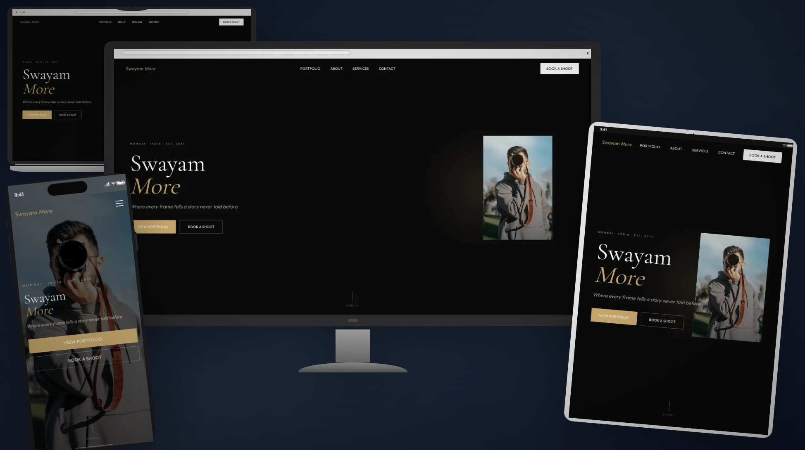

# Swayam — Photographer Portfolio

A modern, immersive photographer portfolio website built to showcase creative work through a visually engaging and cinematic web experience.

The project combines a clean editorial design with smooth interactions, responsive layouts, and image-focused presentation to create a professional online presence for a photographer.

## 🔗 Live Demo

**[View Live Website](https://swayammore.vercel.app/)**
---

## 📸 Preview



---

## 📸 About the Project

Swayam is a modern photographer portfolio website designed to put visual storytelling at the center of the user experience.

The website is structured to help visitors:

* Discover the photographer and their creative style
* Explore featured photography work
* Learn about available services
* Read client testimonials
* Get in touch through the contact section

The overall experience focuses on strong visual hierarchy, immersive imagery, smooth interactions, and responsive design.

## ✨ Features

* **Modern Hero Section** — Creates a strong first impression with an immersive visual introduction.
* **Responsive Navigation** — Provides easy access to the different sections of the website.
* **Photography Showcase** — Highlights creative work through an image-focused portfolio experience.
* **Services Section** — Presents the photographer's services in a clear and structured layout.
* **Testimonials** — Displays client feedback to build trust and credibility.
* **Contact Section** — Provides visitors with an easy way to connect with the photographer.
* **Smooth Animations** — Uses motion and transitions to create a more engaging browsing experience.
* **Responsive Design** — Optimized for desktop, tablet, and mobile screen sizes.
* **Modern UI** — Uses a clean, minimal, and cinematic visual direction.

## 🛠️ Tech Stack

* **React** — Component-based UI development
* **TypeScript** — Type-safe JavaScript development
* **Vite** — Fast development and build tooling
* **Tailwind CSS** — Utility-first styling and responsive design
* **GSAP** — Animation and motion
* **JavaScript / TypeScript** — Interactive functionality
* **ESLint** — Code quality and consistency

## 🎨 Design Approach

The design of Swayam is built around a **minimal, cinematic, and image-first visual experience**.

The main design principles include:

* Keeping photography as the primary visual focus
* Using whitespace to create a premium and uncluttered experience
* Establishing a clear visual hierarchy
* Using motion to enhance the experience rather than distract from it
* Maintaining consistency across different sections
* Creating a responsive experience across devices

## 📂 Project Structure

```text
Swayam-Portfolio/
├── public/
│   └── ...
│
├── src/
│   ├── assets/
│   ├── components/
│   ├── pages/
│   ├── App.tsx
│   └── main.tsx
│
├── .gitignore
├── eslint.config.js
├── index.html
├── package.json
├── package-lock.json
├── tailwind.config.ts
├── tsconfig.app.json
├── tsconfig.json
├── tsconfig.node.json
├── vite.config.ts
└── README.md
```

> The structure above represents the main project organization. Individual files and folders may change as the project evolves.

## 🚀 Getting Started

### 1. Clone the Repository

```bash
git clone https://github.com/karanpr01/Swayam-Portfolio.git
```

### 2. Navigate to the Project

```bash
cd Swayam-Portfolio
```

### 3. Install Dependencies

```bash
npm install
```

### 4. Start the Development Server

```bash
npm run dev
```

The application will start on the local development server provided by Vite.

## 📦 Build for Production

To create a production build:

```bash
npm run build
```

To preview the production build locally:

```bash
npm run preview
```

## 🧠 What I Learned

Through this project, I strengthened my understanding of:

* Building modern interfaces with React
* Using TypeScript in frontend development
* Structuring reusable React components
* Creating responsive layouts
* Designing image-focused portfolio experiences
* Implementing animations and interactive experiences
* Managing a modern frontend project with Vite
* Improving visual hierarchy and user experience
* Combining design and development to create a polished web experience

## 🔮 Future Improvements

Possible future improvements include:

* Adding advanced portfolio filtering and categorization
* Improving image optimization and lazy loading
* Adding dedicated project detail pages
* Implementing more advanced page transitions
* Integrating a CMS for managing photography projects
* Improving accessibility and keyboard navigation
* Further optimizing Core Web Vitals and overall performance
* Adding additional interactive storytelling elements

## 📱 Responsive Design

The website is designed to provide a consistent experience across:

* 💻 Desktop
* 📱 Mobile
* 📟 Tablet

## 📄 License

This project was created as a portfolio project for learning, experimentation, and showcasing frontend development skills.

## 👨‍💻 Author

### Prem Karan

Frontend / Full-Stack Web Developer

* **GitHub:** [@karanpr01](https://github.com/karanpr01)
* **Live Project:** [Swayam — Photographer Portfolio](https://swayammore.vercel.app/)

---

⭐ If you like this project, consider giving the repository a star!
